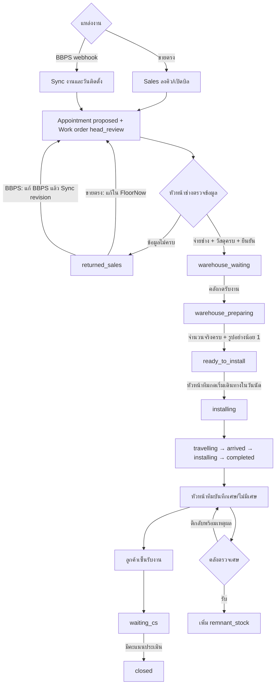
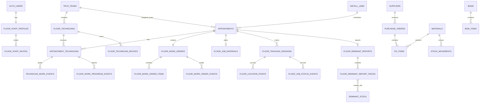

# Business Analysis — FloorNow

> วิเคราะห์จาก source code ณ วันที่ 24 สิงหาคม 2569 (2026-08-24) เท่านั้น  
> ขอบเขตหลัก: `app/`, `components/`, `lib/`, `middleware.ts`, `mobile/`, `supabase/migrations/`, `vercel.json`  
> คำว่า **สันนิษฐานจาก...** หมายถึง repository นี้ไม่มี DDL/model ต้นฉบับครบ แต่พบการอ่าน/เขียนข้อมูลจาก code ที่ระบุ

## ภาพรวมระบบ

FloorNow เป็นระบบจัดการงานติดตั้งพื้นของ MPD Group ตั้งแต่ฝ่ายขายจองคิวหรือรับงานจาก BBPS, หัวหน้าช่างตรวจข้อมูลและออกใบสั่งงาน, คลังเตรียมวัสดุ, จ่ายงานให้ช่างรายบุคคล, ช่างรายงานสถานะพร้อมรูปและตำแหน่ง, ลูกค้าเซ็นรับงาน, คลังตรวจรับเศษ และ CS ประเมินก่อนปิดงาน ระบบมี web สำหรับพนักงาน/ช่าง/ลูกค้า, mobile app สำหรับ Background GPS และเชื่อม BBPS, Google Sheets และ Supabase เป็นหลัก (`app/`, `mobile/`, `lib/bbps-sync.ts`, `supabase/migrations/20260823190000_operational_flow_v2.sql`).

---

# 1. Business Flow

## 1.1 Actors และสิทธิ์

| Actor/Role | หน้าที่จาก code | พื้นที่หลัก | หลักฐาน |
|---|---|---|---|
| `admin` | เข้าถึงทุกหน้าฝั่งพนักงาน, เชิญ/แก้ role, ทำงานแทนฝ่ายปฏิบัติการ | `/home`, `/staff` และทุก admin route | `middleware.ts`, `app/(admin)/staff/page.tsx` |
| `sales` | สร้าง/แก้คิวขายตรง, ดูคิว, แก้งานขายตรงที่ถูกตีกลับ | `/sales-queue`, `/share/queue`, `/tech-queue`, `/orders` | `middleware.ts`, `components/sales/returned-work-orders.tsx` |
| `head_technician` | ตรวจความพร้อม, จ่ายช่างรายบุคคล/หัวหน้าทีม, กำหนดวัสดุและยืนยันใบสั่งงาน, ตีกลับ | `/operations`, `/orders`, `/appointments`, `/technicians` | `app/(admin)/operations/page.tsx`, `app/(admin)/orders/[jobNo]/page.tsx` |
| `warehouse` | รับใบสั่งงาน, บันทึกจำนวนหยิบจริง/รูป, ตรวจรับเศษ | `/warehouse`, `/orders`, `/remnants` และเครื่องมือคลัง | `app/(admin)/warehouse/page.tsx`, `app/(admin)/remnants/page.tsx` |
| ช่างรายบุคคล | เปิด/รับทราบงานของตน, รายงานสถานะ/รูป, หัวหน้าทีมรับงานติดตั้งและบันทึกเศษ/ลายเซ็น | `/work/[token]` + PIN; mobile app | `app/work/[token]/page.tsx`, `mobile/App.tsx` |
| `cs` | บันทึกการประเมินและปิดงาน | `/cs-tracking`, `/dashboard` | `app/(admin)/cs-tracking/page.tsx` |
| `executive` | ดูภาพรวมและ dashboard | `/exec`, `/dashboard` | `middleware.ts`, `app/(admin)/exec/page.tsx` |
| ลูกค้า/บุคคลภายนอก | ดูสถานะ/รูป/ทีม/ETA จาก token; ลูกค้าเซ็นในใบงานช่าง | `/status/[token]`, `/track/[token]` | `app/status/[token]/page.tsx`, `app/track/[token]/page.tsx` |
| BBPS | ส่งงาน/แก้ revision/ปิดงานผ่าน webhook | `/api/webhook/bbps` | `app/api/webhook/bbps/route.ts`, `lib/bbps-sync.ts` |

## 1.2 End-to-end Flow หลัก



## 1.3 การรับงานจากฝ่ายขายและ BBPS

### A. งานขายตรง

1. `sales` เปิด `/sales-queue`/`/share/queue` และกรอกลูกค้า, โทรศัพท์, ที่อยู่หรือแผนที่, รายละเอียดสินค้า/งาน, วันเวลา, ทีม, survey และรูปหน้างานตามแบบฟอร์ม.
2. ระบบตรวจเวลาชนกับ appointment ทีมเดียวกัน แล้วสร้าง/แก้ `install_jobs` และ `appointments`; appointment เริ่มที่ `proposed`, งานรอหัวหน้าช่าง.
3. Trigger สร้าง `floor_work_orders` ที่ `head_review` เมื่อ appointment มี `job_id`.
4. หากถูกตีกลับ Sales แก้ข้อมูลใน FloorNow และกดส่งใหม่ผ่าน `resubmit_floor_work_order_v3`; สถานะกลับ `head_review`.
5. หลักฐาน: `app/share/queue/page.tsx`, `components/sales/returned-work-orders.tsx`, `supabase/migrations/20260823190000_operational_flow_v2.sql`, `20260823230000_work_order_v3.sql`.

### B. งาน BBPS

1. BBPS ส่ง `POST/PUT /api/webhook/bbps` พร้อม Bearer `BBPS_INGEST_TOKEN`.
2. ระบบ upsert งานแบบ idempotent ด้วย `(source, external_id)` และ appointment ด้วย `ext_ref`; วันที่ติดตั้งที่ valid ถูกทำเป็นช่วง 09:00–17:00 ทีม B.
3. ถ้าขาด quote/customer/phone/address-or-map ระบบตั้ง `รอฝ่ายขายเติมข้อมูล`; ถ้าครบตั้ง `รอหัวหน้าช่างยืนยัน`.
4. ถ้าหัวหน้าช่างตีกลับ งานคง `returned_sales` จน BBPS แก้ข้อมูลต้นทางและส่ง payload revision ใหม่ จึงกลับ `head_review` อัตโนมัติ.
5. Event `completed/deleted/cancelled` หรือ status ที่ไม่ใช่ `queued/installing` ปิด/ยกเลิกบล็อกคิว.
6. ปีมากกว่า 2100 ถูกเตือนและ block วันที่นั้น ไม่แปลง พ.ศ./ค.ศ. อัตโนมัติ.
7. หลักฐาน: `app/api/webhook/bbps/route.ts`, `lib/bbps-sync.ts`, `supabase/migrations/20260822190000_unified_install_flow.sql`, `20260823230000_work_order_v3.sql`.

## 1.4 หัวหน้าช่างตรวจและออกใบสั่งงาน

1. เปิด `/operations`; tab `head_review` คือ “ต้องตัดสินใจ”, `returned_sales` คือถูกส่งกลับ, สถานะอื่นที่ยังไม่ปิดเป็นกำลังดำเนินงาน.
2. จ่ายช่างรายบุคคลผ่าน `appointment_technicians`; ต้องมีอย่างน้อยหนึ่งคนและมี `is_lead` หนึ่งคนก่อนยืนยัน.
3. เปิด `/orders/[jobNo]`, ตรวจข้อมูลลูกค้า/โทรศัพท์/สถานที่/สินค้า, survey/รูป/ใบสั่งงาน BBPS, แล้วเพิ่มรายการวัสดุ/อุปกรณ์.
4. Rule ใน DB: ต้องมี customer, phone, address หรือ map, specification, lead technician และ item อย่างน้อย 1; item ต้องมี category/name/unit/จำนวนไม่ติดลบ.
5. UI บังคับ `floor_material` มี SKU; SKU ที่ไม่อยู่ใน `materials` ต้องยืนยันข้อยกเว้นและบันทึก note `[อนุมัติ SKU นอกคลัง]`.
6. กดยืนยันเรียก `confirm_floor_work_order_v2`: บันทึกรายการ, คำนวณ planned sheet count, appointment เป็น `confirmed`, work order เป็น `warehouse_waiting`.
7. หากข้อมูลไม่พร้อม กดตีกลับพร้อมเหตุผลผ่าน `return_floor_work_order_v3`.
8. หลักฐาน: `app/(admin)/operations/page.tsx`, `components/appointments/technician-assignment.tsx`, `app/(admin)/orders/[jobNo]/page.tsx`, `supabase/migrations/20260823190000_operational_flow_v2.sql`.

## 1.5 คลังเตรียมสินค้า

1. `warehouse` เห็นงานสามคอลัมน์ที่ `/warehouse`: `warehouse_waiting`, `warehouse_preparing`, `ready_to_install`.
2. กดรับงาน: เฉพาะ `admin/warehouse`; DB บันทึกผู้รับและเปลี่ยนเป็น `warehouse_preparing`.
3. ผู้รับงานคนเดิม (หรือ admin) ใส่ `actual_qty` ครบทุก item และอัปโหลดรูปอย่างน้อย 1 รูป; UI รองรับหลายรูปพร้อม preview.
4. กดเตรียมเสร็จ: เป็น `ready_to_install`; `install_jobs.status` เป็น “รอติดตั้ง”.
5. หลักฐาน: `app/(admin)/warehouse/page.tsx`, `app/(admin)/orders/[jobNo]/page.tsx`, `complete_floor_warehouse_order_v2` ใน `20260823190000_operational_flow_v2.sql`.

## 1.6 ช่างรับทราบและทำงานหน้างาน

1. หัวหน้าช่างสร้างช่าง/กำหนด PIN และส่ง personal link `/work/[personal_token]`; ช่างใส่ PIN เพื่อเปิดเฉพาะ assignment ที่ active ของตน.
2. การเปิดใบงานบันทึก `opened`/จำนวนครั้ง/เวลา; ช่างกด “รับทราบงาน” บันทึก `acknowledged`.
3. ทุกสถานะต้องทำตามลำดับ `travelling → arrived → installing → completed`, มีรูปอย่างน้อย 1 รูปและ timestamp; `travelling` ต้องกรอกจำนวนแผ่นที่หยิบจริง.
4. เฉพาะ assignment ที่เป็น lead เริ่มรับงานติดตั้งได้ และตาม rule ปกติต้องเป็นวันนัดหรือหลังวันนัด; job ที่ขึ้นต้น `TEST-` ยกเว้นข้อจำกัดวันสำหรับ UAT.
5. เมื่อเริ่มเดินทาง work order เปลี่ยน `ready_to_install → installing`; สถานะถึงหน้างาน/ติดตั้ง/เสร็จถูกเก็บเป็น events.
6. หลัง `completed` หัวหน้าทีมต้องส่งรายงานเศษก่อนให้ลูกค้าเซ็น.
7. หลักฐาน: `app/work/[token]/page.tsx`, `supabase/migrations/20260824010000_web_technician_acknowledgement.sql`, `20260824030000_test_ticket_early_start.sql`, `20260823170000_staff_auth_and_roles.sql`.

## 1.7 Flow เศษแบบ A

1. เฉพาะ lead และต้องมีสถานะ `completed` แล้ว จึงส่งรายงานได้.
2. เลือก “ไม่มีเศษ” หรือเพิ่มชิ้นเศษ; ห้ามเลือกไม่มีเศษพร้อมมีรายการ.
3. แต่ละชิ้นต้อง width 110/140, length > 0, qty 1–100, thickness 6/16, color B/W และมีรูปอย่างน้อย 1.
4. รายงานเริ่ม `pending_review`; แก้ส่งใหม่ได้จนกว่าคลังรับ.
5. คลัง `accept` แล้วสร้าง `remnant_stock` หนึ่ง row ต่อจำนวนชิ้นและล็อกรายงาน; `reject` ต้องมีเหตุผลและช่างแก้ส่งใหม่ได้.
6. ลูกค้าเซ็นได้เมื่อรายงานเป็น `pending_review` หรือ `accepted`; ไม่ต้องรอคลังตรวจรับเสร็จ.
7. หลักฐาน: `components/technician/remnant-report-form.tsx`, `app/(admin)/remnants/page.tsx`, `supabase/migrations/20260824050000_remnant_flow_a.sql`.

## 1.8 ลูกค้าเซ็น, CS และปิดงาน

1. เฉพาะ lead, หลัง progress ล่าสุดเป็น `completed` และมีรายงานเศษ valid จึงบันทึกชื่อลูกค้า/ลายเซ็น.
2. Trigger เปลี่ยน `floor_work_orders` เป็น `waiting_cs`, appointment เป็น `completed`, `install_jobs.stage` อย่างน้อย 5 และ status “รอ CS โทรประเมิน”.
3. CS บันทึก `job_evaluations`; ถ้า work order รอ CS จะเรียก `close_floor_work_order_cs_v3`.
4. DB อนุญาตปิดเมื่อมี `satisfaction_score`; จากนั้นเป็น `closed`, legacy stage 6/“เสร็จสิ้น”.
5. Scheduled sync จาก Google Sheets ยังสามารถอัปเดต legacy stage 6 และ `eval_score` ได้.
6. หลักฐาน: `app/(admin)/cs-tracking/page.tsx`, `20260823190000_operational_flow_v2.sql`, `20260823230000_work_order_v3.sql`, `app/api/sync-evaluations/route.ts`, `vercel.json`.

## 1.9 Background GPS และลูกค้าติดตาม

1. Mobile app enroll personal token + PIN, ผูกเครื่อง และขอ location permission; app ส่งตำแหน่ง background ทุกประมาณ 60 วินาทีหรือ 250 เมตร.
2. ถ้า offline เก็บ outbox สูงสุด 500 จุด ส่ง batch ละ 50 และ retry 3 รอบ.
3. ETA คำนวณใน `/api/tracking/eta` จาก Haversine × 1.35 และความเร็วประมาณ 12–60 km/h; provider คือ `local_estimate` ไม่ใช่ Google Routes.
4. `/track/[token]` แสดงสถานะ/ETA/ระยะ/รูป แต่ไม่แสดง raw GPS; `/status/[token]` แสดงสถานะใบงาน/ทีม/วันนัด/เหตุการณ์.
5. หลักฐาน: `mobile/src/tracking-task.ts`, `app/api/tracking/eta/route.ts`, `app/track/[token]/page.tsx`, `app/status/[token]/page.tsx`.

## 1.10 State Transition

### Work order (แกนหลักปัจจุบัน)

| From | Action/เงื่อนไข | To | ผู้ทำ |
|---|---|---|---|
| `head_review` | ตีกลับ + reason | `returned_sales` | admin/head |
| `returned_sales` | ขายตรง resubmit หรือ BBPS revision ใหม่ | `head_review` | sales/BBPS |
| `head_review` | ข้อมูล+lead+items ครบ, confirm | `warehouse_waiting` | admin/head |
| `warehouse_waiting` | รับงาน | `warehouse_preparing` | admin/warehouse |
| `warehouse_preparing` | actual ครบ + รูป ≥1 | `ready_to_install` | ผู้รับคลัง/admin |
| `ready_to_install` | lead เริ่มเดินทางตามวันนัด | `installing` | lead technician |
| `installing` | completed + remnant report + customer signature | `waiting_cs` | lead technician |
| `waiting_cs` | มี evaluation score | `closed` | admin/cs |
| ไม่ใช่ `closed` | appointment cancelled | `cancelled` | flow นัดหมาย |

### สถานะประกอบ

| Entity | States ที่ code กำหนด |
|---|---|
| `appointments.status` | `proposed`, `confirmed`, `completed`, `cancelled` (`app/(admin)/appointments/page.tsx`) |
| Field progress | `travelling`, `arrived`, `installing`, `completed`, `customer_signed` (`20260823170000_staff_auth_and_roles.sql`) |
| GPS session | `travelling`, `arrived`, `installing`, `completed`, `cancelled` (`20260822183409_background_gps_tracking.sql`) |
| Remnant report | `pending_review`, `accepted`, `rejected` (`20260824050000_remnant_flow_a.sql`) |
| Remnant stock | `available`, `reserved`, `used` (`app/(admin)/remnants/page.tsx`) |
| Purchase order | `draft`, `ordered`, `partial`, `received` **สันนิษฐานจาก UI transition** `app/(admin)/purchase-orders/page.tsx`; DDL ไม่อยู่ใน migrations ชุดนี้ |
| Legacy install pipeline | stage 1–6 ตาม `IP_STAGES` (`lib/types.ts`); ยังใช้กับ dashboard/queue/documents และ sync บางส่วน |

---

# 2. Feature List

## 2.1 Core operational features

| Module/Feature | ทำอะไร | ผู้ใช้ | ไฟล์หลัก |
|---|---|---|---|
| Staff Auth/RBAC | email/password, first user bootstrap admin, invite, activate, role gate | ทุก staff; admin จัดการ | `app/login/page.tsx`, `middleware.ts`, `lib/staff*.ts`, `20260823170000_staff_auth_and_roles.sql` |
| Sales queue | ปฏิทิน, เปิด/แก้บิลขายตรง, survey/photos, conflict check | sales/admin | `app/share/queue/page.tsx`, `app/(admin)/sales-queue/page.tsx` |
| BBPS ingestion | upsert/close งาน BBPS แบบ idempotent | system | `app/api/webhook/bbps/route.ts`, `lib/bbps-sync.ts` |
| Returned inbox | งานขายตรงแก้ใน FloorNow; BBPS แสดงเหตุผลและรอ source revision | sales/admin | `components/sales/returned-work-orders.tsx` |
| Operations decision | ตรวจข้อมูล, ตีกลับ, จ่ายช่าง, เปิดใบสั่งงาน | head/admin | `app/(admin)/operations/page.tsx` |
| Central work order | ดูข้อมูลขาย/BBPS/รูป, วัสดุ SKU/จำนวน, confirm, history, external link | head/warehouse/sales/admin ตาม action | `app/(admin)/orders/[jobNo]/page.tsx` |
| Work-order list | ค้น/กรองใบสั่งงานและเปิดรายละเอียด | sales/head/warehouse/admin | `app/(admin)/orders/page.tsx` |
| Warehouse board | รับงาน/เห็นผู้รับ/สถานะเตรียม/พร้อมติดตั้ง | warehouse/admin | `app/(admin)/warehouse/page.tsx` |
| Appointment calendar | ดู/สร้าง/ยืนยัน/ยกเลิกคิวและทีม | head/admin | `app/(admin)/appointments/page.tsx` |
| Technician master/PIN | เพิ่ม/แก้/ปิดช่าง, team/lead, personal link, PIN, reset device | head/admin | `components/appointments/technician-manager.tsx`, `app/(admin)/technicians/page.tsx` |
| Individual assignment | ผูก appointment ↔ ช่างหลายคน และกำหนด lead | head/admin | `components/appointments/technician-assignment.tsx` |
| Technician web workspace | PIN, ตารางเฉพาะตน, open/ack, status, photos, order detail | technician | `app/work/[token]/page.tsx` |
| Remnant Flow A | ช่างรายงานเศษ/ไม่มีเศษ; คลังรับ/ตีกลับและเพิ่ม stock | lead, warehouse/admin | `components/technician/remnant-report-form.tsx`, `app/(admin)/remnants/page.tsx` |
| Customer signature | ชื่อ+ลายเซ็นหลังจบงานและรายงานเศษ | lead/customer | `app/work/[token]/page.tsx`, `20260824050000_remnant_flow_a.sql` |
| External status | เปิด/ปิด/rotate token; แสดงวันนัด ทีม ขอบเขต milestones/photos | head/admin สร้าง; public ดู | `app/status/[token]/page.tsx`, `20260823230000_work_order_v3.sql` |
| CS evaluation/close | โทรประเมิน, ตอบคำถาม, คะแนน, ปิดงาน | cs/admin | `app/(admin)/cs-tracking/page.tsx` |
| Executive overview | KPI งาน, revenue, waste/issue | executive/admin | `app/(admin)/exec/page.tsx`, `app/api/exec-overview/route.ts` |

## 2.2 Supporting/legacy/experimental features

| Module | ความสามารถจาก code | กลุ่ม | ไฟล์ |
|---|---|---|---|
| Legacy Pipeline | Kanban stage 1–6, drawer, survey/QC/material usage/NCR | head/admin | `app/(admin)/pipeline/page.tsx`, `components/pipeline/*` |
| Jobs/Queue/Overview | list/group/count `install_jobs` ตาม legacy stage | admin (route); บางหน้าไม่อยู่ sidebar | `app/(admin)/jobs`, `queue`, `overview` |
| Documents/Job order | เอกสารตาม stage, public printable job order | admin / public | `app/(admin)/documents/page.tsx`, `app/job-order/[jobNo]/page.tsx` |
| Satisfaction dashboard | ดึง Google Sheets CSV, chart/ความเห็น | cs/executive/admin | `app/(admin)/dashboard/page.tsx`, `app/api/satisfaction-survey/route.ts` |
| Evaluation config | CRUD คำถามประเมิน | admin | `app/(admin)/evaluation-config/page.tsx` |
| Inventory | วัสดุ, on-hand, movement | warehouse/admin | `app/(admin)/inventory/page.tsx` |
| Waste cost | วางแผนพื้นที่/การตัด, เศษ, movement/cost | warehouse/admin | `app/(admin)/waste-cost/page.tsx` |
| BOM/BOQ | BOM/items, simulation | warehouse/admin | `app/(admin)/bom/page.tsx` |
| Purchase Order | supplier, PO/items, รับเข้า stock | warehouse/admin | `app/(admin)/purchase-orders/page.tsx` |
| NCR | สร้าง/เปลี่ยนสถานะปัญหา | head/admin | `app/(admin)/ncr/page.tsx`, `components/pipeline/ncr-tab.tsx` |
| Service | service management UI | admin; sidebar ระบุทดลอง | `app/(admin)/service/page.tsx` |
| Legacy evaluation | ลูกค้าประเมินผ่าน query token | public | `app/eval/page.tsx` |
| Legacy dispatch | redirect token เก่าไป personal work link | public | `app/dispatch/[token]/page.tsx` |

## 2.3 System/background/integrations

| Integration/Job | พฤติกรรมจริง | Authentication/Rule | ไฟล์ |
|---|---|---|---|
| Supabase | DB, Auth, RLS/RPC, Storage `job-photos` | staff JWT หรือ token/PIN RPC | `lib/supabase/*`, migrations |
| BBPS | webhook upsert/close + full raw payload/images | Bearer `BBPS_INGEST_TOKEN` | `app/api/webhook/bbps/route.ts` |
| Google Sheets survey | public CSV read; scheduled import คะแนน | optional `CRON_SECRET` สำหรับ sync | `app/api/satisfaction-survey`, `sync-evaluations`, `vercel.json` |
| Vercel Cron | เรียก sync ทุกวัน 01:00 UTC ตาม cron expression | Vercel/optional secret | `vercel.json` |
| Local ETA | Haversine-based ETA; ไม่ใช้ paid Routes API | device/session RPC + throttle | `app/api/tracking/eta/route.ts` |
| Expo Background Location | Android/iOS background task, foreground notification Android, secure token/PIN | device token/secret | `mobile/src/*`, `mobile/app.json` |
| Generic order webhook | upsert `install_jobs` stage 1 จาก `order_no` | Bearer `ORDER_INGEST_TOKEN`; ปิดด้วย 503 ถ้ายังไม่ตั้งค่า | `app/api/webhook/order/route.ts` |

---

# 3. Site Map

## 3.1 Navigation tree

```mermaid
flowchart LR
  Root[/] --> Login[/login]
  Root --> Staff[Staff workspace]
  Root --> Public[Token/Public]
  Staff --> Sales[/sales-queue · /tech-queue]
  Staff --> Ops[/operations · /appointments · /technicians]
  Staff --> Orders[/orders · /orders/:jobNo]
  Staff --> Wh[/warehouse · /remnants]
  Staff --> CS[/cs-tracking · /dashboard]
  Staff --> Exec[/exec]
  Staff --> Admin[/staff · experimental tools]
  Public --> Work[/work/:token]
  Public --> Status[/status/:token · /track/:token]
  Public --> Legacy[/dispatch/:token · /job-order/:jobNo · /eval]
```

## 3.2 Staff routes จาก routing จริง

ทุก route ใน `(admin)` ต้อง login จาก `app/(admin)/layout.tsx`; role gate อยู่ใน `middleware.ts`. `admin` เข้าได้ทั้งหมด.

| Path | หน้า/หน้าที่ | Role ที่ middleware อนุญาตนอกเหนือจาก admin | สถานะใน sidebar |
|---|---|---|---|
| `/home` | ทางลัด FloorNow Operations | admin เท่านั้นตาม ROLE_ACCESS | Core |
| `/sales-queue` | คิวขาย + งานตีกลับ | sales | Core |
| `/tech-queue` | มุมมองคิวช่าง/รายละเอียด BBPS | sales | Core |
| `/operations` | ศูนย์ตัดสินใจ/จ่ายงาน | head_technician | Core |
| `/orders` | รายการใบสั่งงาน | sales, head_technician, warehouse | Core |
| `/orders/[jobNo]` | ใบสั่งงานกลางและ action ตาม role/status | sales, head_technician, warehouse | ผ่านรายการ |
| `/warehouse` | บอร์ดรับ/เตรียมสินค้า | warehouse | Core |
| `/appointments` | ปฏิทิน/จัดทีม/นัดหมาย | head_technician | Core |
| `/pipeline` | legacy stage board | head_technician | Core |
| `/technicians` | ช่าง/PIN/device | head_technician | Core |
| `/cs-tracking` | ประเมิน/ปิดงาน | cs | Core |
| `/dashboard` | satisfaction/waste dashboard | cs, executive | Core |
| `/exec` | executive KPI | executive | Core |
| `/staff` | บัญชีพนักงาน | admin | Core |
| `/inventory` | คลังวัสดุ | warehouse | Experimental |
| `/remnants` | เศษและคิวตรวจรับ | warehouse | Experimental ใน sidebar แม้เป็นส่วนของ Flow A |
| `/waste-cost` | ต้นทุนเศษ/วางแผนตัด | warehouse | Experimental |
| `/bom` | BOQ/BOM | warehouse | Experimental |
| `/purchase-orders` | PO/Supplier/รับสินค้า | warehouse | Experimental |
| `/ncr` | NCR | head_technician | Experimental |
| `/service` | งานบริการ | admin | Experimental |
| `/documents` | เอกสาร legacy | admin | Experimental/Core เดิม |
| `/jobs`, `/queue`, `/overview`, `/docs`, `/evaluation-config` | legacy/utility pages | admin (เพราะไม่มี prefix ใน role allow-list) | ไม่พบใน sidebar ปัจจุบัน |

> `/share/queue` ไม่อยู่ใน `(admin)` แต่ไม่อยู่ใน public allow-list จึงยังต้อง login; `sales` ได้สิทธิ์จาก `ROLE_ACCESS` (`middleware.ts`).

## 3.3 Public/token routes

| Path | หน้าที่ | Login | การควบคุม |
|---|---|---|---|
| `/login` | sign in/sign up/activate staff | ไม่ต้อง | Supabase Auth |
| `/work/[token]` | ตารางงานช่างและใบงาน | ไม่ต้อง staff login | personal token + PIN, active assignment |
| `/dispatch/[token]` | redirect ลิงก์เก่า | ไม่ต้อง | RPC resolve; ถ้ายังไม่จ่ายงานไม่เปิดข้อมูล |
| `/status/[token]` | สถานะใบสั่งงานสำหรับลูกค้า | ไม่ต้อง | external share token + enabled |
| `/track/[token]` | สถานะเดินทาง/ETA/หลักฐาน | ไม่ต้อง | customer tracking token |
| `/eval?t=...` | แบบประเมิน legacy | ไม่ต้อง | query token |
| `/job-order/[jobNo]` | ใบงานช่าง printable แบบเดิม | ต้อง login; middleware อนุญาตเฉพาะ admin | ใช้ job number โดยตรงหลังผ่าน staff auth |

## 3.4 API endpoint map

| Method/Path | หน้าที่ | Auth ใน endpoint |
|---|---|---|
| `POST,PUT /api/webhook/bbps` | BBPS upsert/close | Bearer `BBPS_INGEST_TOKEN` |
| `POST /api/webhook/order` | generic install job upsert | Bearer `ORDER_INGEST_TOKEN` |
| `POST /api/tracking/eta` | authorize session, คำนวณ/บันทึก ETA | device/session RPC |
| `GET,POST /api/sync-evaluations` | import Google Sheet → legacy stage 6 | บังคับ Bearer `CRON_SECRET` |
| `GET /api/satisfaction-survey` | proxy/parse survey CSV | active staff role admin/cs/executive |
| `GET /api/exec-overview` | KPI จาก view/jobs/zones/materials | active staff role admin/executive |
| `GET /auth/callback` | แลก auth code และ redirect | Supabase auth code |

---

# 4. Data Relationship

## 4.1 Entities ที่มี DDL ใน repository

| Entity | ประเภท | ความหมาย/field สำคัญ | PK/FK |
|---|---|---|---|
| `floor_staff_profiles` | Master/Auth | email, full_name, role, is_active | PK/FK `id → auth.users` |
| `floor_staff_invites` | Transaction/Auth | email, role, invited_by, used_by/at | PK `id`; FK staff/auth |
| `floor_technicians` | Master | team_id, name, phone, lead, active, personal_token, pin_hash | PK `id`; FK `team_id → tech_teams` |
| `appointment_technicians` | Bridge/Transaction | appointment, technician, is_lead, active, opened/ack | PK `id`; FK appointment/technician |
| `technician_work_events` | Audit | assigned/revoked/opened/acknowledged | identity PK; FK assignment |
| `floor_work_progress_events` | Transaction/Audit | status, note, photos, picked count, signature | identity PK; FK appointment/assignment/technician |
| `floor_work_orders` | Transaction หลัก | job_no, status, revision, confirmed/warehouse/install/CS timestamps, share token | PK `id`; unique/FK appointment; staff/assignment FKs |
| `floor_work_order_items` | Transaction detail | category, sku, planned/actual qty, unit, source | PK `id`; FK work_order |
| `floor_work_order_events` | Audit | from/to status, actor, note, photos, metadata | identity PK; FK work_order/staff/technician |
| `floor_job_materials` | Transaction plan | planned/picked sheet count, planner/picker | PK `id`; unique FK appointment; FK technician |
| `floor_technician_devices` | Device master | technician, platform, token/secret, permission, revoked | PK `id`; FK technician |
| `floor_tracking_sessions` | Transaction | appointment/assignment/device, destination/latest, ETA/distance, customer token, status | PK `id`; FKs appointment/assignment/technician/device |
| `floor_location_points` | Telemetry | lat/lng/accuracy/speed/heading/captured_at | identity PK; FK session/technician/device |
| `floor_job_status_events` | Transaction/Audit | travelling/arrived/installing/completed/signed, photos | identity PK; FK session/assignment/technician |
| `floor_remnant_reports` | Transaction | job, no_remnant, materials JSON, status/review | PK `id`; unique appointment; FKs order/assignment/technician/staff |
| `floor_remnant_report_pieces` | Transaction detail | dimensions, qty, 6/16, B/W, photos, stock ids | PK `id`; FK report |

DDL: `supabase/migrations/20260822183409_background_gps_tracking.sql`, `20260822210000_technician_workspace.sql`, `20260823170000_staff_auth_and_roles.sql`, `20260823190000_operational_flow_v2.sql`, `20260824050000_remnant_flow_a.sql`.

## 4.2 Entities ที่ application ใช้ แต่ DDL ต้นฉบับไม่อยู่ใน migrations ชุดนี้

รายการต่อไปนี้เป็น **สันนิษฐานจากการ select/insert/update และ TypeScript interfaces ในไฟล์ที่อ้าง** จึงระบุเฉพาะ field ที่ code ใช้ ไม่สรุป constraint ที่มองไม่เห็น.

| Entity | ประเภท | Field/ความสัมพันธ์ที่เห็นจาก code | อ้างอิง |
|---|---|---|---|
| `install_jobs` | Transaction หลัก/legacy | `job_no`, source/external_id, stage/status, bill/customer/product/location, raw_payload, survey/photos, waiting, evaluation, handover | `lib/bbps-sync.ts`, `lib/types.ts`, pages หลัก |
| `appointments` | Transaction | id, job_id, tech_id, slot_start/end, status, ext_ref | `app/(admin)/appointments/page.tsx`; migrations อ้าง FK |
| `tech_teams` | Master | id, name, is_active | `app/share/queue/page.tsx`, `app/(admin)/orders/[jobNo]/page.tsx` |
| `materials` | Master/Stock | id, sku, name, unit, qty_on_hand, unit_cost | `app/(admin)/inventory/page.tsx` |
| `stock_movements` | Transaction | material_id, type, qty, ref_po_id, job/note | `app/(admin)/inventory/page.tsx`, `purchase-orders/page.tsx` |
| `remnant_stock` | Stock | id, width_bin, length_cm, mat_type, status, source_job/reserved_for | `app/(admin)/remnants/page.tsx`, `waste-cost/page.tsx` |
| `install_job_zones` | Transaction detail | job_no, width_cm, length_cm และข้อมูล layout | `app/(admin)/waste-cost/page.tsx` |
| `job_evaluations` | Transaction | job_no, satisfaction_score และคำตอบ | `app/(admin)/cs-tracking/page.tsx` |
| `evaluation_questions` | Master | คำถาม/active/order | `app/(admin)/evaluation-config/page.tsx`, `cs-tracking/page.tsx` |
| `job_evals` | Transaction legacy | evaluation token/ข้อมูลแบบประเมิน | `app/eval/page.tsx` |
| `job_activity` | Audit legacy | ประวัติเปลี่ยนงาน | `components/pipeline/job-drawer.tsx` |
| `ncr_reports` | Transaction | job/title/type/severity/status/owner/description | `app/(admin)/ncr/page.tsx` |
| `suppliers` | Master | supplier identity/contact | `app/(admin)/purchase-orders/page.tsx` |
| `purchase_orders` | Transaction | po_number, supplier, status, totals/dates | `app/(admin)/purchase-orders/page.tsx` |
| `po_items` | Transaction detail | po_id, material_id, ordered/received qty, price | `app/(admin)/purchase-orders/page.tsx` |
| `boms`, `bom_items` | Master/config | product/version and material quantities | `app/(admin)/bom/page.tsx` |
| `install_sku_watch` | Transaction/monitor | SKU watch records | `app/(admin)/service/page.tsx` |
| `v_floor_install_kpis` | Read model/view | month, orders, qty, revenue | `app/api/exec-overview/route.ts` |

## 4.3 ER Diagram



> เส้นระหว่าง `install_jobs.job_no` กับ `appointments.job_id` และกลุ่ม legacy เป็นความสัมพันธ์ที่ **สันนิษฐานจาก query/join ใน application** ไม่ใช่ FK ที่ยืนยันจาก DDL ใน repository นี้.

---

# 5. วิเคราะห์ความสมบูรณ์และสิ่งที่ไม่จำเป็น

## 5.1 ความสมบูรณ์ตาม code

| ด้าน | ระดับ | หลักฐาน/ข้อจำกัด |
|---|---|---|
| Core end-to-end work order | สูง | มี state/RPC/permission ตั้งแต่ `head_review` ถึง `closed`, audit events และ UI ทุกฝ่าย |
| Sales direct + BBPS | สูง | มี idempotency, return/resubmit แยก source, BBPS token auth |
| Material preparation | สูง | planned/actual, SKU exception, owner และ photo evidence ถูกบังคับ |
| Individual technician access | สูง | personal token+PIN, active assignment filter, open/ack evidence, lead rule |
| Field evidence | สูง | sequential status + multiple photo preview + timestamp/signature |
| Remnant Flow A | สูง | validation, review, stock creation และ signature gate อยู่ใน DB |
| Background GPS | ปานกลาง | source สำหรับ Android/iOS และ offline outbox ครบ; repository ไม่ยืนยันว่า build ถูก publish/ติดตั้ง production แล้ว |
| ETA | ปานกลาง | ใช้งานได้แบบประมาณค่า local แต่ไม่ใช้ traffic/road routing จริง |
| Automated tests | ต่ำ | `package.json` ไม่มี test/e2e script; พบ UAT ผ่านข้อมูล `TEST-*` แต่ไม่ใช่ automated regression suite |
| Schema reproducibility | ปานกลาง | migrations มีเฉพาะตารางใหม่บางส่วน; legacy tables จำนวนมากไม่มี CREATE TABLE ใน repo นี้ |
| Security boundary | ปานกลางถึงสูง | staff pages มี Auth+RBAC; endpoint ข้อมูล/ingest หลักตรวจ role หรือ secret ภายใน แม้ middleware ยกเว้น `/api` |

## 5.2 ช่องว่าง/ความเสี่ยงที่พบจาก code

1. **มีสอง state models** — `floor_work_orders.status` เป็น flow ใหม่ แต่ `install_jobs.stage/status` ยังใช้ใน pipeline/dashboard/documents/sync. Trigger/RPC sync บางช่วงเท่านั้น จึงมีโอกาสไม่ตรงกันเมื่อ legacy UI เขียนตรง (`lib/types.ts`, `components/pipeline/job-drawer.tsx`, migrations V2/V3).
2. **Client เขียนตารางโดยตรงหลายจุด** — assignment, inventory, PO, remnant stock และ legacy pages อาศัย RLS ที่ schema บางส่วนไม่อยู่ใน repo; ไม่สามารถพิสูจน์ permission ครบจาก codebase นี้.
3. **ไม่มี automated regression test** — ความถูกต้องของ flow ขึ้นกับ manual UAT; โดยเฉพาะ trigger/RPC และ role matrix ควรมี integration/E2E tests.
4. **DDL legacy ไม่ครบใน version control** — ทำให้สร้าง environment ใหม่และ audit FK/RLS ไม่ได้จาก repository เพียงอย่างเดียว.

## 5.3 ส่วนซ้ำ/ไม่จำเป็นต่อ Core Flow ปัจจุบัน

คำว่า “ไม่จำเป็น” ในส่วนนี้หมายถึง **ไม่อยู่ในเส้นทางหลัก V3 หรือซ้ำกับหน้าปัจจุบันตาม code** ไม่ได้ยืนยันว่าธุรกิจไม่ใช้ จึงควรวัด usage ก่อนลบ.

| Candidate | เหตุผลจาก code | ข้อเสนอ |
|---|---|---|
| `/jobs`, `/queue`, `/overview` | เป็น list/count legacy `install_jobs.stage`; ซ้ำ `/orders`, `/operations`, `/exec` และไม่อยู่ sidebar | archive หลังยืนยันว่าไม่มี bookmark/deep link |
| `/pipeline` + `job-drawer` flow เก่า | เขียน legacy stage/material flow ขนานกับ central work order | freeze write actions แล้วทยอยย้าย read-only/history |
| `/documents` และ `/job-order/[jobNo]` | เอกสาร legacy ซ้ำรายละเอียดใน `/orders/[jobNo]`/`/work/[token]`; printable route จำกัด admin แล้ว | รวมเป็น central order/print view เดียว |
| `/dispatch/[token]` | compatibility redirect เท่านั้น | เก็บชั่วคราวจนลิงก์เก่าหมดอายุ แล้วถอด |
| `/eval` + Google Sheets sync | ซ้ำกับ `cs-tracking`/`job_evaluations` และมีสองแหล่งคะแนน | เลือก canonical evaluation source หนึ่งระบบ |
| `/service`, inventory/waste/BOM/PO/NCR | sidebar ระบุ “เครื่องมือทดลอง”; บาง module มีประโยชน์แต่ไม่บังคับ Core V3 | ซ่อนตาม role/feature flag จน UAT และ RLS ครบ |
| `/docs`, `/evaluation-config` | route มีแต่ไม่อยู่ sidebar | ตัดสินใจว่าจะรองรับจริงหรือเอาออก เพื่อลด dead navigation |

## 5.4 ลำดับปรับปรุงที่แนะนำจากหลักฐาน

1. ตั้ง `ORDER_INGEST_TOKEN` และ `CRON_SECRET` ใน production ก่อนเปิด endpoint ที่เกี่ยวข้อง.
2. กำหนด `floor_work_orders.status` เป็น source of truth เดียว และทำ legacy pages read-only/redirect.
3. นำ legacy DDL/RLS ที่ยังขาดเข้าสู่ migrations ให้สร้างระบบใหม่ได้ครบ.
4. เพิ่ม integration tests ของ RPC transitions และ E2E แยก role: Sales → Head → Warehouse → Lead → Remnant → Signature → CS.
5. UAT mobile build บนอุปกรณ์ Android/iPhone จริง: background/permission/offline/restart/battery optimization.
6. วัดการใช้ experimental/legacy routes แล้วซ่อนหรือลบเฉพาะหน้าที่ไม่มีผู้ใช้จริง.

---

## Appendix: Source of truth ที่ใช้วิเคราะห์

- Routing/RBAC: `app/**/page.tsx`, `app/**/route.ts`, `middleware.ts`, `app/(admin)/layout.tsx`, `components/layout/sidebar.tsx`
- Core business logic: `lib/bbps-sync.ts`, `lib/work-orders.ts`, `lib/staff.ts`, `lib/survey.ts`
- Database rules: migrations ตั้งแต่ `20260822183409_background_gps_tracking.sql` ถึง `20260824050000_remnant_flow_a.sql`
- Mobile: `mobile/App.tsx`, `mobile/src/job-service.ts`, `mobile/src/pin-auth.ts`, `mobile/src/tracking-task.ts`
- Deployment/integration config: `package.json`, `vercel.json`, `next.config.ts`, `mobile/app.json`, `mobile/eas.json`
